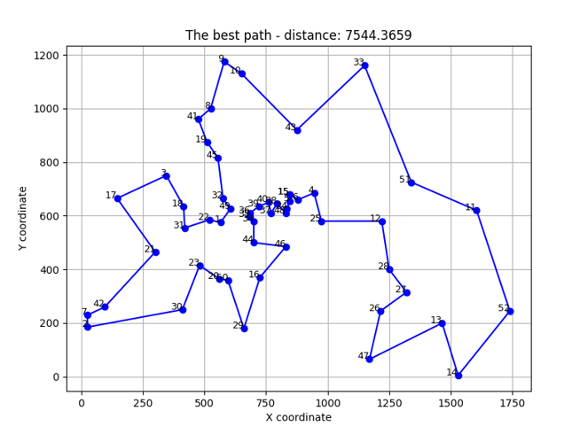

# Problem putujućeg trgovca (TSP) — Genetski algoritam

Ovaj projekat implementira **genetski algoritam** za rješavanje problema putujućeg trgovca (TSP).  
Cilj je pronaći najkraću moguću rutu koja obilazi sve gradove i vraća se u početnu tačku.

## Najbolje pronađeno rješenje

  
Vizuelni prikaz najkraće rute pronađene tokom izvršavanja algoritma.

## Autori

- Aleksandar Stevanović, SV04/2023
- Milan Kačarević, SV73/2023
